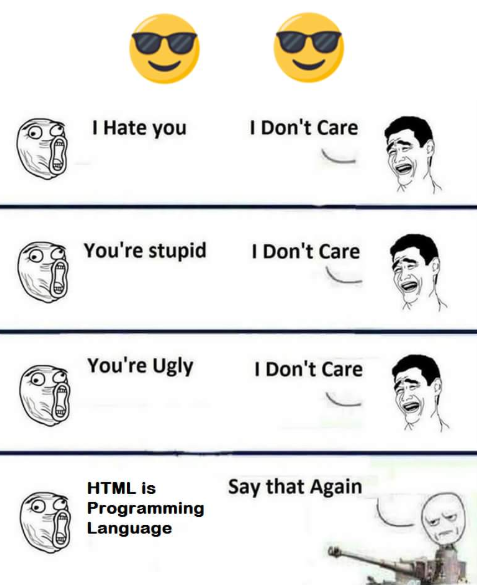
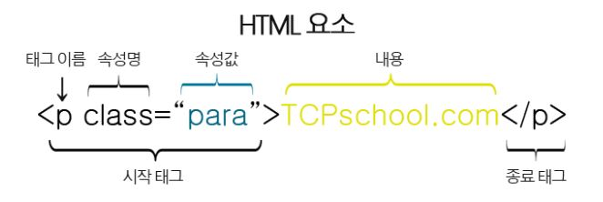

# HTML

## 개요

평소 친숙하다고 생각했지만 알면 알수록 모르는 내용이 많은 것 같아 이번 기회에 HTML에 대해서 자세하게 정리해보겠습니다.

## HTML



[출처](https://devrant.com/rants/1189177/html-is-a-programming-language)

HTML은 hypertext markup language의 약자로 프로그래밍 언어가 아닌 마크업언어입니다. 내용의 관련된 부분을 감싸거나 둘러싸거나 마크업하여 작동하도록 합니다.

## HTML 문서 기본 구조 

```
<!DOCTYPE html>
<html lang="en">
<head>
    <meta charset="UTF-8">
    <title>Document</title>
</head>
<body>
    
</body>
</html>
```

* **DOCTYPE**

자신이 작성한 HTML 코드가 어떤 방식의 HTML 코드로 작성되었는지를 선언하는 문자입니다. 

DOCTYPE 선언은 HTML 태그는 아니지만, 선언된 HTML 버전이 무엇인지를 웹 브라우저에 알려주는 역할을 하는 선언문으로 대소문자 구별이 없습니다.

* **html**

전체 html 문서를 감싸는 태그입니다. 하나만 존재해야 하고 html 바깥에 DOCTYPE을 제외한 다른 태그가 있으면 안됩니다.

* **head**

html 문서에 대한 정보를 나타내는 부분입니다. 하나만 존재해야하고, html 바로 아래에 위치해야합니다.

* **title**

head 안에 들어가는 태그로 제목 표시줄의 내용을 나타냅니다.

* **meta**

문서에 대한 설명을 표시합니다. 사람에게는 보이지 않고, 브라우저만 읽을 수 있는 속성으로, charset="UTF-8"이라고 한 것은 브루우저에게 한글 인코딩 UTF-8로 설정하라고 알린 의미입니다. 이 부분이 있어야 한글이 깨지지 않습니다. 

## HTML 요소

