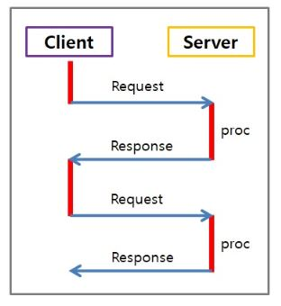

# Asynchronous, Synchronous와 Blocking, Non-Blocking

## Asynchronous(비동기) Synchronous(동기)

둘의 차이는 **결과물을 가져오는 시점**이 다르다.

### **Asynchronous**

* 요청과 결과가 **동시에 일어나지 않는다**. 즉, 요청을 보낸 후 응답(결과)과 상관없이 다음 작업이 진행된다.

* 비동기식 처리를 요청할 때는 할 일이 끝난 후 처리 결과를 알려주는 콜백 함수를 함께 알려준다. 이 콜백 함수를 통해 결과물을 가져온다.

[이미지 출처](https://jieun0113.tistory.com/73)

### **Synchronous**

* 요청과 결과가 **동시에 일어난다**. 즉, 요청을 하면 시간이 얼마나 걸리든 요청한 위치에서 결과가 올 때까지 대기해야한다.

[이미지 출처](https://jieun0113.tistory.com/73)

